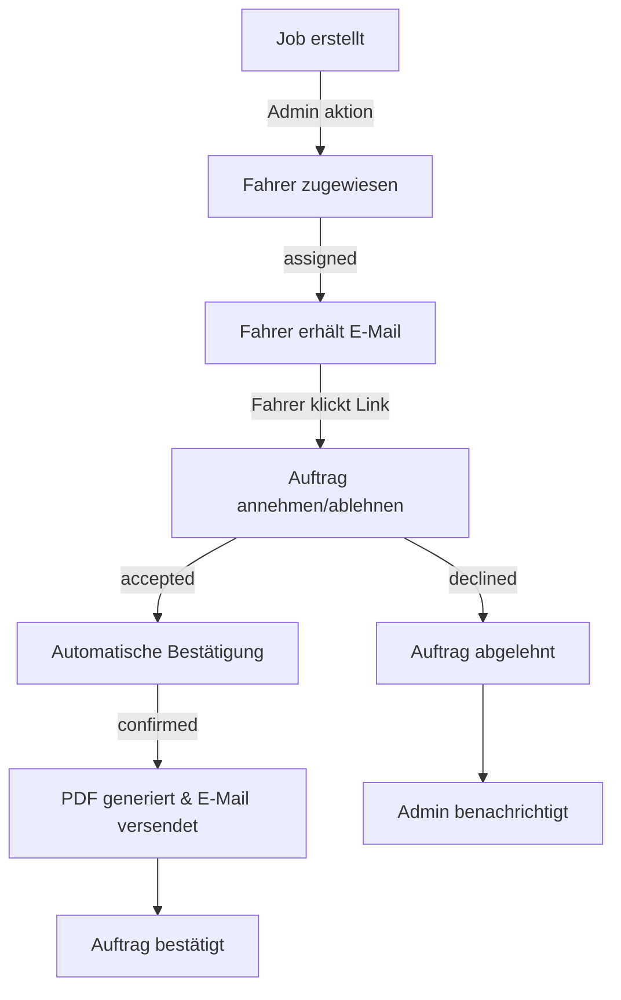

# Order Confirmation System - Betriebsdokumentation

**Version:** 1.0  
**Datum:** 2025-09-17  
**System:** kraftfahrer-mieten.com

---

## Überblick

Das Order Confirmation System ermöglicht es Fahrern, zugewiesene Aufträge anzunehmen oder abzulehnen. Bei Annahme wird automatisch eine rechtssichere Auftragsbestätigung mit PDF an den Auftraggeber versendet.

## Workflow & Statuskette



### Status-Definitionen

| Status | Beschreibung | Admin-Aktion möglich |
|--------|--------------|---------------------|
| `open` | Neu erstellter Job | Fahrer zuweisen |
| `assigned` | Fahrer zugewiesen, wartet auf Antwort | Warten |
| `accepted` | Fahrer hat angenommen, Bestätigung läuft | - |
| `confirmed` | Bestätigung versendet, PDF archiviert | PDF ansehen, neu senden |
| `declined` | Fahrer hat abgelehnt | Neuen Fahrer zuweisen |

## Technische Komponenten

### 1. Datenbank-Tabellen

**`job_assignments`**
- Verbindet Jobs mit Fahrern
- Speichert Status und Zeitstempel
- Rate und Konditionen

**`email_log`**
- Protokolliert alle E-Mails
- Status: pending, sent, error
- Fehlerbehandlung

**`feature_flags`**
- `ORDER_CONFIRMATION_ENABLED` (default: false)
- Ermöglicht Ein/Aus-Schalten

### 2. Edge Functions

**`send-order-confirmation`**
- Generiert E-Mail + PDF
- Archiviert im Storage
- Protokolliert in email_log
- Aktualisiert Status auf 'confirmed'

### 3. UI-Komponenten

**Fahrer-Seite (`/job/{assignmentId}/response`)**
- Auftragsdetails anzeigen
- Annehmen/Ablehnen Buttons
- Rechtsbedingungen

**Admin-Erweiterungen**
- Zuweisungsstatus-Spalte
- PDF ansehen/neu senden Buttons
- Erweiterte Status-Badges

## Rechtstext-Quelle

Der in E-Mail und PDF verwendete Rechtstext stammt aus der finalen Fassung vom 2025-09-17:

```
Vermittlungs- und Provisionsbedingungen
1. Provisionspflicht: 15% des Nettohonorars
2. Folgeaufträge: Provisionspflicht gilt auch für direkte Aufträge
3. Dauer: Bis zur Festanstellung
4. Informationspflicht: Direktanfragen melden
5. Vertragsstrafe: 2.500,00 € bei Verstoß
6. Verbindlichkeit für Auftraggeber
```

**Quelle:** kraftfahrer-mieten.com/vermittlung

## Feature Flag Management

### Aktivierung
```sql
UPDATE public.feature_flags 
SET enabled = true 
WHERE flag_name = 'ORDER_CONFIRMATION_ENABLED';
```

### Deaktivierung (Rollback)
```sql
UPDATE public.feature_flags 
SET enabled = false 
WHERE flag_name = 'ORDER_CONFIRMATION_ENABLED';
```

**Verhalten bei deaktiviertem Flag:**
- Edge Function gibt `success: false` zurück
- Keine E-Mails werden versendet
- Status bleibt auf 'accepted'
- Bestehende Funktionen unberührt

## Fehlerfälle & Retry

### E-Mail-Versand fehlgeschlagen
1. **Status:** Assignment bleibt auf 'accepted'
2. **Logging:** error_message in email_log
3. **Admin-UI:** "Neu senden" Button verfügbar
4. **Retry:** Admin kann Bestätigung manuell neu auslösen

### PDF-Generierung fehlgeschlagen
1. **E-Mail:** Wird ohne Anhang versendet
2. **Logging:** Fehler in Edge Function Logs
3. **Status:** Wird trotzdem auf 'confirmed' gesetzt

### Ungültige Assignment-ID
1. **Response:** 404 mit Fehlermeldung
2. **Fahrer-UI:** "Auftrag nicht gefunden"
3. **Keine Änderungen** an Datenbank

## Storage & Archivierung

### PDF-Storage
- **Bucket:** `confirmations` (private)
- **Pfad:** `/{job_id}/Auftragsbestaetigung_{job_id}_{date}.pdf`
- **Zugriff:** Nur Admins via RLS

### E-Mail-Archivierung
- **Tabelle:** `email_log`
- **Retention:** Unbegrenzt
- **Zugriff:** Admin-only

## Monitoring & Debugging

### Log-Locations
1. **Edge Function Logs:** Supabase Dashboard → Functions → send-order-confirmation
2. **Email Log:** `SELECT * FROM email_log WHERE template = 'order_confirmation'`
3. **Assignment Status:** `SELECT * FROM job_assignments WHERE status IN ('accepted', 'confirmed')`

### Wichtige Metriken
- Annahme-Rate: `accepted / assigned`
- Bestätigungs-Erfolg: `confirmed / accepted` 
- E-Mail-Fehlerrate: `error / sent` in email_log

## Sicherheit

### No-Touch-Bereiche (unverändert)
- ✅ Bestehende Edge Functions
- ✅ Kontakt-/Anfrage-Formulare
- ✅ Domain/SMTP-Konfiguration
- ✅ GTM/Analytics

### Neue Sicherheitsmaßnahmen
- RLS auf allen neuen Tabellen
- Feature Flag als Kill-Switch
- Input-Validierung in Edge Function
- Error-Logging ohne sensitive Daten

## Rollback-Strategie

### Sofortiger Rollback
```sql
UPDATE public.feature_flags SET enabled = false WHERE flag_name = 'ORDER_CONFIRMATION_ENABLED';
```

### Vollständiger Rollback
1. Feature Flag deaktivieren
2. Edge Function aus config.toml entfernen
3. Neue Tabellen-Policies entfernen (optional)
4. Storage Bucket leeren (optional)

**Auswirkung:** System verhält sich wie vor dem Update.

## Testing

### Manueller E2E-Test
1. **Setup:** Testjob erstellen, Fahrer zuweisen
2. **Aktion:** Fahrer nimmt an über `/job/{id}/response`
3. **Ergebnis:** E-Mail + PDF an Auftraggeber, Status 'confirmed'
4. **Prüfung:** email_log, Storage, Admin-UI

### Fehlerfall-Tests
1. **Ungültige E-Mail:** Fahrer-Annahme mit defekter Auftraggeber-E-Mail
2. **Feature Flag aus:** Annahme ohne Bestätigung
3. **Storage-Fehler:** PDF-Upload fehlschlägt

---

## Support & Kontakt

**Admin:** info@kraftfahrer-mieten.com  
**Technisch:** Siehe Supabase Dashboard → Functions → Logs  
**Feature Requests:** GitHub Issues oder direkte Kommunikation